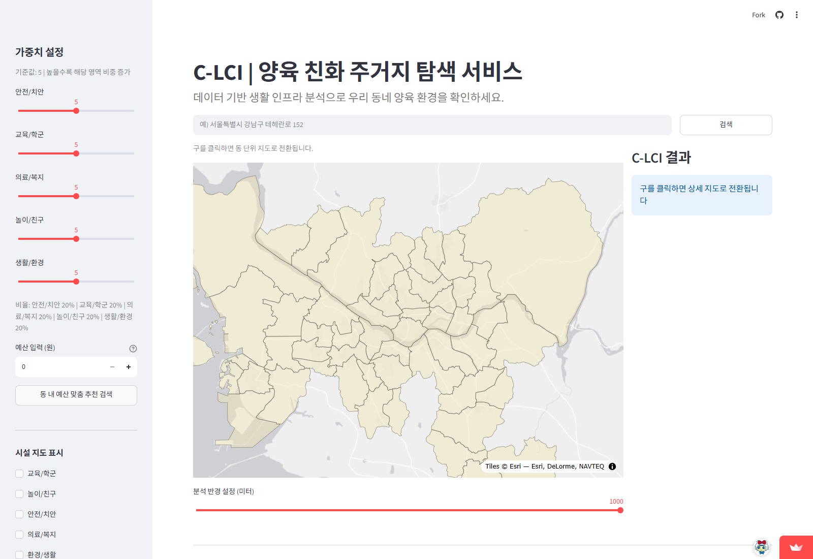
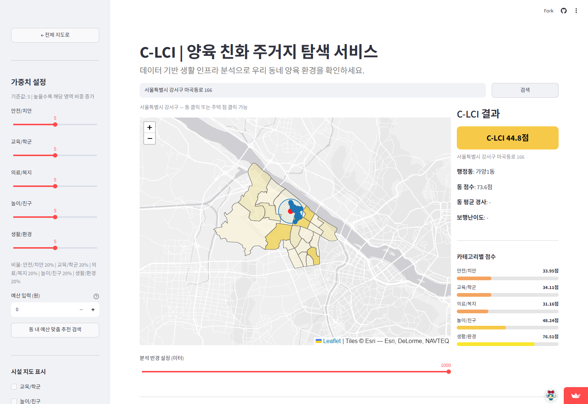
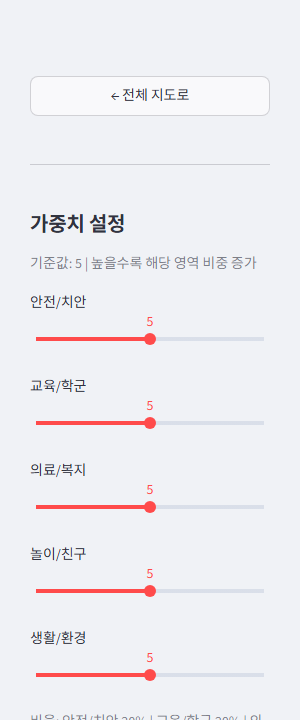
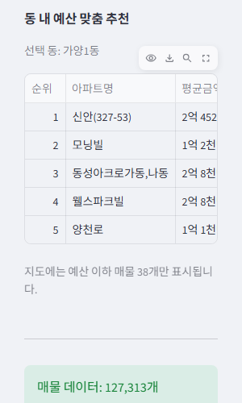
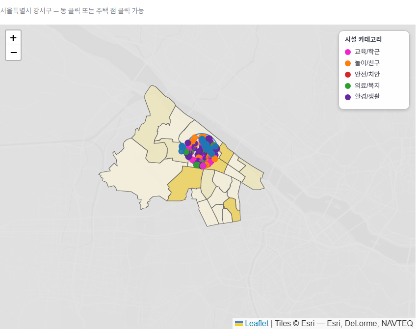
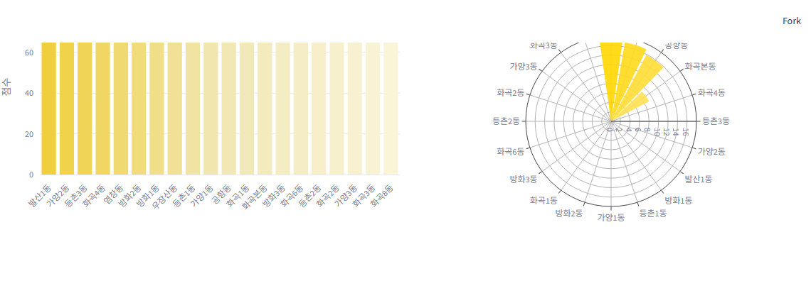
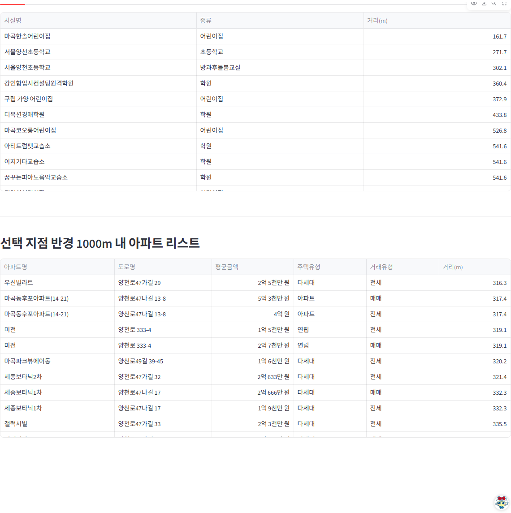
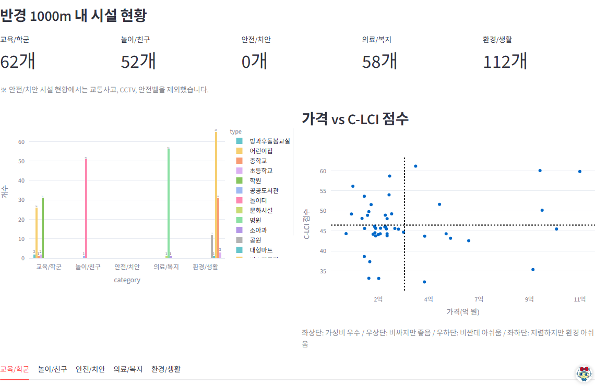

# CL-IC

**▶ 데모:** [CL-IC 서비스 바로가기](https://kim-jin22-cl-ic.streamlit.app/)

공공데이터를 기반으로 육아 인프라(놀이/의료/교육/치안/생활환경)를 행정동·주소 단위로 지수화하고, 예산과 조건에 맞는 육아친화 주거지를 지도에서 추천해주는 Streamlit 서비스입니다. (부트캠프 2차 팀 프로젝트, 팀명 CL-ICKER, 4인 팀, 14일 개발)

## 내 역할 - PM/총괄

- **프로젝트 총괄**: 문제 정의, 팀 업무 분담, 일정 관리, 발표/보고서 구조 총괄. Google Sheets 기반 업무 분담·일정 관리 체계를 직접 설계해 팀 운영에 활용
- **C-LCI 지수 설계 주도**: 논문 근거를 바탕으로 교육·의료·안전·놀이·생활환경 5개 인프라 영역의 가중치 산출 로직을 직접 설계
- **놀이/친구 인프라 데이터 수집·정제**: 키즈카페·놀이터·도서관 등 놀이/친구 카테고리 공공데이터 수집 및 전처리 직접 담당
- **Streamlit 앱 직접 구현**: Choropleth 지도 시각화를 포함한 Streamlit UI를 직접 개발

## 기술 스택


Python · Streamlit · Pandas · Folium/Plotly(지도 시각화) · Kakao API(주소 지오코딩) · Rasterio/Shapely(공간 데이터 처리)

## 데모

**Choropleth 지도 전환**


**지도 클릭 기반 위치 분석**


**카카오 API 기반 주소 → 좌표 변환**


## 주요 기능

**1. 주소 기반 C-LCI 계산 / 2. 행정동 기반 탐색(Choropleth Map)**



주소 입력 → 카카오 API로 위경도·행정동 자동 변환 → 5개 카테고리 + 종합 점수 산출. 행정동별 C-LCI 점수를 색상 단계로 지도에 시각화해 양육 친화 지역을 직관적으로 비교합니다.

**3. 선택 위치 기반 C-LCI 분석 / 4. 카테고리별 점수 시각화**



선택 위치의 C-LCI 종합 점수, 행정동 점수, 경사도·보행난이도 등 주거 환경 정보를 제공하고, 안전·교육·의료·놀이·생활환경 5개 카테고리 점수를 바 차트로 시각화해 강점·약점을 한눈에 비교합니다.

**5. 맞춤형 가중치 설정**



5개 카테고리 중요도를 슬라이더로 직접 조정해 개인 맞춤 C-LCI를 재산출합니다.

**6. 예산 기반 추천 기능**



주거 예산 + 가중치를 함께 반영해 양육 환경과 경제 조건을 동시에 고려한 최적 주거지를 추천합니다.

**7. 반경 내 카테고리별 시설 위치 시각화**



사용자가 설정한 반경 내 카테고리별 시설 위치를 지도 위에 색상으로 구분해 표시합니다.

**8. 구 내 동별 점수·아동 밀집도 비교**



선택한 구의 동별 점수와 아동 밀집도를 그래프로 시각화하여 비교합니다.

**9. 반경 내 시설·아파트 매물 리스트**



선택 지점 반경 내 시설 목록과 아파트 매물 리스트를 거리순으로 제공합니다.

**10. 반경 내 시설 현황 및 가격 대비 분석**



반경 내 카테고리별 시설 개수와 가격 대비 C-LCI 점수 산점도로 가성비를 분석합니다.

## 작업 흐름

1. **데이터 수집 및 정제**: 놀이(키즈카페·놀이터·도서관), 교육, 의료(소아과·백신접종률), 치안(CCTV·파출소), 생활환경(공원·미세먼지 등) 공공데이터 정제 (`notebooks/` 참고, 카테고리별 전처리 노트북 22종)
2. **동별 지수 산출**: 카테고리별 인프라 지수를 정규화·가중치 적용하여 행정동 단위 C-LCI 지수로 산출 (`data/infra_index/` - 세부 카테고리별 지수 → 카테고리별 동별 지수 → 최종 합산)
3. **지도 시각화**: Choropleth 지도, 반경 1km 인프라 분석, 맞춤 가중치, 예산 기반 주거지 추천 기능을 Streamlit + Folium으로 구현

## 실행 방법

```bash
pip install -r app/requirements.txt
streamlit run app/app.py
```

카카오 API 키가 필요합니다. `app/.env.example`을 참고해 `.env` 파일에 `KAKAO_API_KEY`를 설정해 주세요.

## 산출물

- `app/app.py` - 최종 Streamlit 앱
- `notebooks/` - 데이터 정제 및 동별 지수 산출 노트북 22종
- `data/infra_index/` - 카테고리별·행정동별 인프라 지수 산출물
- `data/sample/` - 최종 지수 산출 결과 샘플 (원본 raw 데이터는 용량 문제로 미포함)
- `docs/` - 제안서, 결과보고서, 상세보고서(발표용)

## 팀

부트캠프 4기 2차 프로젝트, 팀명 CL-ICKER, 4인 (PM/총괄: 본인)
