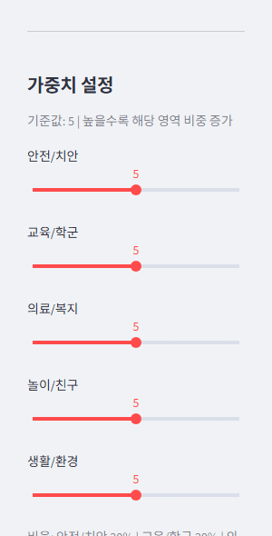
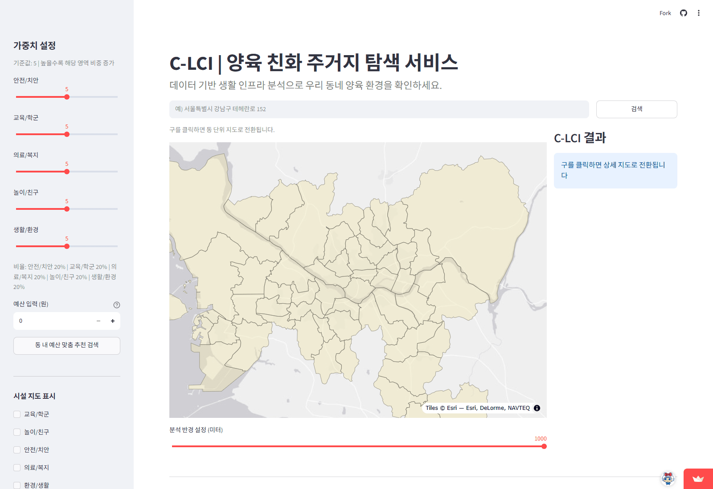

# CL-IC

**▶ 데모:** [CL-IC 서비스 바로가기](https://kim-jin22-cl-ic.streamlit.app/)

공공데이터를 기반으로 육아 인프라(놀이/의료/교육/치안/생활환경)를 행정동·주소 단위로 지수화하고, 예산과 조건에 맞는 육아친화 주거지를 지도에서 추천해주는 Streamlit 서비스입니다. (부트캠프 2차 팀 프로젝트, 팀명 CL-ICKER, 4인 팀, 14일 개발)

## 내 역할 - PM/총괄

- **프로젝트 총괄**: 문제 정의, 팀 업무 분담, 일정 관리, 발표/보고서 구조 총괄. Google Sheets 기반 업무 분담·일정 관리 체계를 직접 설계해 팀 운영에 활용
- **C-LCI 지수 설계 주도**: 논문 근거를 바탕으로 교육·의료·안전·놀이·생활환경 5개 인프라 영역의 가중치 산출 로직을 직접 설계
- **놀이/친구 인프라 데이터 수집·정제**: 키즈카페·놀이터·도서관 등 놀이/친구 카테고리 공공데이터 수집 및 전처리 직접 담당
- **Streamlit 앱 직접 구현**: Choropleth 지도 시각화를 포함한 Streamlit UI를 직접 개발

## 기술 스택


Python · Streamlit · Pandas · Folium/Plotly(지도 시각화) · Kakao API(주소 지오코딩) · Rasterio/Shapely(공간 데이터 처리)

## 데모

**Choropleth 지도 전환**


**지도 클릭 기반 위치 분석**


**카카오 API 기반 주소 → 좌표 변환**


## 주요 기능

| | |
|---|---|
|  |  |
| **1·2. 주소 기반 C-LCI 계산 / 행정동 탐색**<br>주소 입력 → 위경도·행정동 자동 변환 → 5개 카테고리 + 종합 점수 산출. 행정동별 점수를 Choropleth 지도로 비교 | **3·4. 선택 위치 분석 / 카테고리별 점수**<br>C-LCI 종합 점수·행정동 점수·경사도 등 제공, 5개 카테고리 점수를 바 차트로 시각화 |
|  |  |
| **5. 맞춤형 가중치 설정**<br>5개 카테고리 중요도를 슬라이더로 조정해 개인 맞춤 C-LCI 재산출 | **6. 예산 기반 추천**<br>주거 예산 + 가중치를 함께 반영해 조건에 맞는 주거지 추천 |
|  |  |
| **7. 반경 내 카테고리별 시설 시각화**<br>설정 반경 내 카테고리별 시설 위치를 지도에 색상으로 구분 표시 | **8. 동별 점수·아동 밀집도 비교**<br>선택한 구의 동별 점수와 아동 밀집도를 그래프로 비교 |
|  |  |
| **9. 반경 내 시설·매물 리스트**<br>선택 지점 반경 내 시설·아파트 매물을 거리순으로 제공 | **10. 반경 내 시설 현황·가격 분석**<br>카테고리별 시설 개수와 가격 대비 C-LCI 산점도로 가성비 분석 |

## 사용자 시나리오

**CASE 1 | 맞춤 주거지 추천** — 자녀 건강과 병원 접근성을 중요하게 생각하는 학부모

1. 거주 희망 지역 입력 → 서대문구 홍제2동
2. 카테고리 가중치 조정 → 의료·복지 인프라에 가장 높은 가중치 설정
3. 예산 입력 → 전세 2억
4. 결과 → 조건 기반 맞춤 주거지 추천



**CASE 2 | 주소 기반 인프라 확인** — 이미 거주할 집은 정했지만 양육 환경이 적합한지 확인하고 싶은 사용자

1. 현재 상황 → 집은 결정했지만 양육 환경 확인 필요
2. 활용 기능 → 주소 검색 기반 C-LCI 점수 조회
3. 사용 방법 → 주소 입력 → C-LCI 점수 및 주변 시설 확인
4. 결과 → 결정한 집 주변의 양육 환경 점수 및 시설 현황 파악


## 작업 흐름

1. **데이터 수집 및 정제**: 놀이(키즈카페·놀이터·도서관), 교육, 의료(소아과·백신접종률), 치안(CCTV·파출소), 생활환경(공원·미세먼지 등) 공공데이터 정제 (`notebooks/` 참고, 카테고리별 전처리 노트북 22종)
2. **동별 지수 산출**: 카테고리별 인프라 지수를 정규화·가중치 적용하여 행정동 단위 C-LCI 지수로 산출 (`data/infra_index/` - 세부 카테고리별 지수 → 카테고리별 동별 지수 → 최종 합산)
3. **지도 시각화**: Choropleth 지도, 반경 1km 인프라 분석, 맞춤 가중치, 예산 기반 주거지 추천 기능을 Streamlit + Folium으로 구현

## 실행 방법

```bash
pip install -r app/requirements.txt
streamlit run app/app.py
```

카카오 API 키가 필요합니다. `app/.env.example`을 참고해 `.env` 파일에 `KAKAO_API_KEY`를 설정해 주세요.

## 산출물

- `app/app.py` - 최종 Streamlit 앱
- `notebooks/` - 데이터 정제 및 동별 지수 산출 노트북 22종
- `data/infra_index/` - 카테고리별·행정동별 인프라 지수 산출물
- `data/sample/` - 최종 지수 산출 결과 샘플 (원본 raw 데이터는 용량 문제로 미포함)
- `docs/` - 제안서, 결과보고서, 상세보고서(발표용)

## 팀

부트캠프 4기 2차 프로젝트, 팀명 CL-ICKER, 4인 (PM/총괄: 본인)
